### Что внутри.

###### Здесь только учебные проекты*

######   * - возможно уже не актуальные

1. [Виджет банковских операций](https://github.com/YURIi454/Yurii_Belousov_home_work)
2. [Приложение для анализа транзакций](https://github.com/YURIi454/Final_work_module_3)
3. [Модуль ООП](https://github.com/YURIi454/mod_14.1-17.2)
4. [Поиск вакансий](https://github.com/YURIi454/Course_work_OOP)
5. [Поиск вакансий + слон](https://github.com/YURIi454/Course_work_job_sh_dtbs_coon)
6. [Основы вёрстки](https://github.com/YURIi454/DJANGO_start)
7. [The world of pain](https://github.com/YURIi454/Online_store_freeman)
8. [Сервис рассылок](https://github.com/YURIi454/Mail_Manage)
9. [DRF + доскер](https://github.com/YURIi454/mod_30.1-33)
10. [Трекер привычек](https://github.com/YURIi454/T_E_T)
11. [Апишка библиотеки](https://github.com/YURIi454/LibMan)
12. [Модель торговой цепи](https://github.com/YURIi454/TECH_TREE)

## Лицензия

[MIT](LICENSE) © 2026 YURIi454
